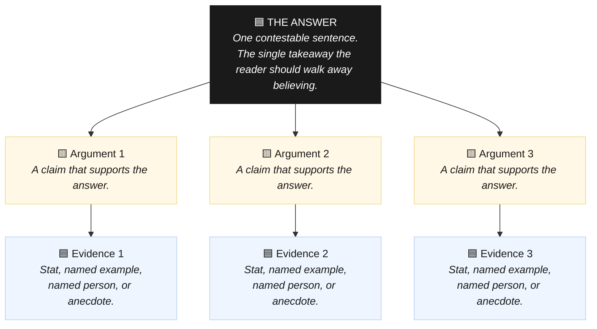

# minto-skill

An AI skill that analyzes any draft or idea against the **Minto Pyramid Principle** and delivers an actionable restructuring plan as a visual HTML artifact. Works with GitHub Copilot, Claude, ChatGPT, Gemini, and any instruction-following LLM.

Give it a draft memo, essay, proposal, or just a raw idea. It extracts the pyramid (one-sentence answer, 2-4 MECE supporting arguments, evidence per argument), diagnoses structural gaps, and tells you exactly what to fix and in what order.

---

## What is the Minto Pyramid Principle?

The Minto Pyramid Principle ([Barbara Minto](https://www.mckinsey.com/alumni/news-and-events/global-news/alumni-news/barbara-minto-mece-i-invented-it-so-i-get-to-say-how-to-pronounce-it), McKinsey) is a framework for clear thinking and communication. Every piece of writing should lead with a single, contestable answer, supported by a small number of mutually exclusive and collectively exhaustive (MECE) arguments, each backed by concrete evidence. The pyramid is the diagnostic engine this skill uses to pressure-test any draft or idea.

> **Further reading:** [The Minto Pyramid Principle](https://www.goodreads.com/book/show/33206.The_Minto_Pyramid_Principle) by Barbara Minto (Goodreads) · [Barbara Minto on MECE](https://www.mckinsey.com/alumni/news-and-events/global-news/alumni-news/barbara-minto-mece-i-invented-it-so-i-get-to-say-how-to-pronounce-it) (McKinsey Alumni)

### The pyramid at a glance



Arguments must be **MECE**: mutually exclusive (no overlap between them) and collectively exhaustive (together they fully prove the answer). Evidence must be concrete: a specific stat with a named source, a named company or person, or a specific anecdote with details.

---

## Getting started

### Prerequisites

- [GitHub Copilot](https://github.com/features/copilot) with agent/skills support enabled in your editor or CLI.

### Install the skill

1. **Fork or clone this repository** into your workspace:

   ```bash
   git clone https://github.com/damianof/minto-skill.git
   cd minto-skill
   ```

2. **Copy the skill into your project's agent skills folder.** The skill lives at `.agents/skills/minto/SKILL.md`. Either copy it directly into a project or keep this repo as a standalone skills library and reference it from your Copilot configuration.

   ```bash
   # Copy into an existing project
   mkdir -p /path/to/your-project/.agents/skills/minto
   cp .agents/skills/minto/SKILL.md /path/to/your-project/.agents/skills/minto/SKILL.md
   ```

3. **Restart your Copilot agent session** so it picks up the new skill.

---

## Usage

Trigger the skill with natural language. Any of these phrases will invoke it:

| Trigger phrase | When to use |
|---|---|
| `minto this` | Pressure-test the most recent draft or idea in the conversation |
| `run minto` | Explicit invocation |
| `apply minto` | Explicit invocation |
| `pyramid this` | Alias for `minto this` |
| `build the pyramid` | Alias for `minto this` |
| `answer-first this` | Reframe a draft so the answer leads |
| `what is the takeaway` | Surface the buried claim |
| `is this MECE` | Check whether arguments overlap or leave gaps |
| `pressure-test this` | Full structural diagnosis |

### Example: pressure-testing a draft memo

You have a draft memo about why your team should switch CI providers. Paste it into the chat and run:

```
minto this
```

The skill will:

1. **Extract the pyramid** — find (or write) the one-sentence answer, map the supporting arguments, and identify the evidence behind each one.
2. **Diagnose gaps** — flag buried answers, overlapping arguments, weak or missing evidence (color-coded red in the output).
3. **Build a numbered restructuring plan** — tell you exactly which sections to move, cut, merge, or strengthen, and give you the exact opener sentence to lead with.
4. **Save a visual HTML artifact** — the full pyramid rendered as a hierarchy with color-coded evidence strength, your new opener, and the step-by-step plan. A link and a 2-4 line summary appear in chat.

### Example: structuring a raw idea

You have an idea but no draft yet:

```
minto this: why most B2B SaaS companies botch their first pricing change
```

The skill builds the pyramid from scratch, identifies what evidence you need to find before you write, and delivers a recommended draft skeleton.

### Example: checking MECE coverage

After a teammate shares a proposal:

```
is this MECE? [paste proposal]
```

The skill maps each argument, checks for overlap (mutual exclusivity) and gaps (collective exhaustiveness), and tells you exactly where the logic breaks down.

---

## Output

Every run produces a single HTML file saved to your workspace:

```
minto-pyramid-{short-topic-slug}.html
```

The file contains:
- **The pyramid** — answer, arguments, and evidence rendered as a visual hierarchy. Evidence boxes are blue (strong) or red (weak/missing).
- **Your opener** — the exact sentence your draft should lead with, plus a note on why it beats the current opener.
- **The restructuring plan** — numbered, actionable steps: move this section, cut these paragraphs, go find this evidence.

A short summary (2-4 lines) linking to the file appears in chat. The HTML is the deliverable.

---

## Using with other AI providers

The skill prompt in `.agents/skills/minto/SKILL.md` is plain Markdown and works with any instruction-following LLM. The steps below show how to use it outside of GitHub Copilot.

### Claude (claude.ai)

**Option A — Claude slash command (recommended):**

Claude supports [custom slash commands](https://docs.anthropic.com/en/docs/claude-code/slash-commands) stored as Markdown files. Create the command once and invoke it with `/minto` in any Claude Code session.

1. In your project (or home directory for global use), create the file:

   ```bash
   mkdir -p .claude/commands
   cp .agents/skills/minto/SKILL.md .claude/commands/minto.md
   ```

2. In Claude Code, type `/minto` followed by your draft or idea:

   ```
   /minto [paste your draft or idea here]
   ```

   The command is available immediately with no restart required. For a global command available in all projects, place the file at `~/.claude/commands/minto.md`.

**Option B — Claude Project instruction (persistent, claude.ai):**

1. Create a [Claude Project](https://support.anthropic.com/en/articles/9517075-what-are-projects) at claude.ai.
2. Open **Project instructions** and paste the full contents of `.agents/skills/minto/SKILL.md`.
3. Every conversation in that project has the skill pre-loaded. Type `minto this` followed by your draft.

**Option C — Single conversation:**

1. Open a new conversation at [claude.ai](https://claude.ai).
2. Paste the full contents of `.agents/skills/minto/SKILL.md` at the top, then add:

   ```
   minto this: [paste your draft or idea below]
   ```

### ChatGPT / OpenAI

**Option A — Custom GPT (recommended for repeated use):**

1. Go to [chatgpt.com/gpts/editor](https://chatgpt.com/gpts/editor) and create a new GPT.
2. In the **Instructions** field, paste the full contents of `.agents/skills/minto/SKILL.md`.
3. Save and publish (or keep private). Share the GPT link with your team.
4. Open the GPT and type `minto this` followed by your draft.

**Option B — Single conversation:**

1. Start a new ChatGPT conversation.
2. Paste the full contents of `.agents/skills/minto/SKILL.md` as your first message, then add:

   ```
   Understood. Now minto this: [paste your draft or idea]
   ```

### OpenAI API / any REST-compatible provider

Pass the SKILL.md content as the `system` message and the user's draft as the `user` message:

```python
import openai, pathlib

skill = pathlib.Path(".agents/skills/minto/SKILL.md").read_text()
draft = "Your draft or idea here..."

response = openai.chat.completions.create(
    model="gpt-4o",
    messages=[
        {"role": "system", "content": skill},
        {"role": "user",   "content": f"minto this:\n\n{draft}"},
    ],
)
print(response.choices[0].message.content)
```

The same pattern works with the Anthropic SDK (`anthropic.messages.create`) by passing the skill as `system` and the draft as the first `user` message.

---

## Contributing

Contributions are welcome. Please follow standard GitHub flow:

1. Fork the repository.
2. Create a feature branch from `main`:
   ```bash
   git checkout -b feat/your-improvement
   ```
3. Make your changes. Keep commits small and focused — one logical change per commit.
4. Write a clear commit message in the imperative mood: `Fix evidence classification for anecdote type`, not `Fixed stuff`.
5. Open a pull request against `main`. Describe what changed and why.

Please do not commit `.DS_Store`, editor config files, or generated HTML artifacts.

---

## License

MIT

